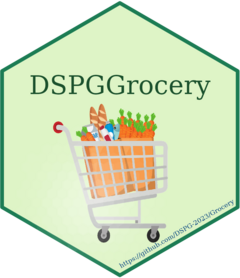

<!-- README.md is generated from README.Rmd. Please edit that file -->

```{r, include = FALSE}
knitr::opts_chunk$set(
  collapse = TRUE,
  comment = "#>",
  fig.path = "man/figures/README-",
  out.width = "100%"
)
```

# DSPGrocery

<!-- badges: start -->
 <a href="https://dspg-2023.github.io/Grocery/"></a>
 


<!-- badges: end -->

The goal of DSPGrocery is to provide an R based tool to help users with decision-making
for opening up a grocery store in a rural environment. The tool itself is an R Shiny app
which uses the functions from the DSPGrocery package to generate market size, 
estimated revenue, expenses and other demographic information.

## Installation

You can install the development version of DSPGrrocery from [GitHub](https://github.com/) with:

``` r
# install.packages("devtools")
devtools::install_github("DSPG-2023/Grocery")
```

## Background

The R Shiny tool and the DSPGrocery package are designed as alternative interfaces to an Excel tool
developed by the ISU Extension and Outreach Farm, Food and Enterprise Development Program. The Excel
workbooks are divided into the following three sections.

 - Estimating Market Size
 - Estimating Revenue
 - Estimating Expenses
 
These correspond to the articles in the vignette sections documenting how each of the excel tools were first converted into R functions and later updated to suit the needs of the R Shiny interface. Those articles can be found in the `Articles` tab on the navigation bar.

## Example

The functions in the package can also be used independently of the R Shiny tool if desired. 
Simply call the functions after loading the library.

```{r example}
library(DSPGGrocery)

## Here is an example outputting the Gross Margin value using a function from the
## package.

GrossMargin <- Gross_Margin(Total_Estimated_Revenue = 120000,
                             Percentage = .25)

print(sprintf("Total Gross Margin: $%d", GrossMargin))
```

A caveat to this is that a portion of the functions in the documentation are helper functions which shouldn't be called directly. Referring to the documentation to determine which functions should be called is best practice.
